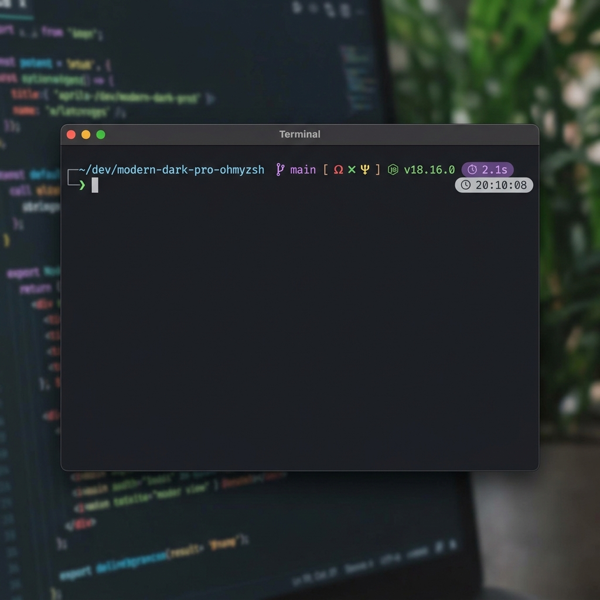

# 🎨 Modern Dark Pro - Oh My Zsh Theme

A premium, modern, and dark-mode-optimized Oh My Zsh theme inspired by the [Modern Dark Pro](https://github.com/dvigo/modern-dark-pro) color palettes. 

Designed for developers who appreciate clean typography, high readability, subtle guide connectors, and fast execution times.

---

## ✨ Features

- **🚀 Dual Variant Support**: Switch between **Night** (pastel tones, soft black) and **Monokai** (vibrant classic Monokai, warm black) to match your editor theme.
- **📁 Smart Path Display**: Shows the working directory cleanly with rich color contrast.
- **🎋 Complete Git Status**:
  - Displays branch name.
  - Interactive status badges: Modified (`` in Red), Staged (`` in Green), Untracked (`` in Yellow), Stashed (`` in Yellow). Separated with generous spacing for maximum legibility.
  - Sync status with remote: Ahead (`` in Green), Behind (`` in Red).
- **⏱️ Execution Timer**: Tracks command duration and prints it (e.g., ` 2.5s`) if it takes longer than 2 seconds (configurable).
- **🕒 Right Prompt Clock**: Displays the current system time (`HH:MM:SS`) on the right side of the terminal, aligned perfectly and out of the way.
- **🐍 Python virtualenv / Conda**: Displays active virtual environments with a custom logo (``) so you always know which environment is running.
- **🔒 Read-only Lock**: Displays a lock icon (``) if you navigate into a folder where you don't have write permissions.
- **⚙️ Background Jobs**: Displays a gear icon (`⚙`) followed by the count of running background jobs in your session.
- ** SSH Indicator**: Displays ` username@host` if you are logged in over SSH, keeping you aware of remote sessions.
- **🟢 Status Feedback**: The prompt symbol (`❯`) turns green on success and red on failure to indicate the command's exit code.
- **⚡ Super Lightweight**: Optimized Git and shell hook code to prevent terminal latency.

---

## 📸 Preview



---

## 📦 Installation

### Prerequisites
- **Oh My Zsh** must be installed. If not, install it via:
  ```bash
  sh -c "$(curl -fsSL https://raw.githubusercontent.com/ohmyzsh/ohmyzsh/master/tools/install.sh)"
  ```

### Step 1: Clone the repository
Clone this project into a local folder:
```bash
git clone https://github.com/dvigo/modern-dark-pro-ohmyzsh.git ~/dev/modern-dark-pro-ohmyzsh
```

### Step 2: Run the installer
Run the provided installer script, which creates a symlink to your Oh My Zsh custom themes folder:
```bash
cd ~/dev/modern-dark-pro-ohmyzsh
./install.sh
```

### Step 3: Configure your `~/.zshrc`
Open your `~/.zshrc` and change the `ZSH_THEME` setting:
```bash
ZSH_THEME="modern-dark-pro"
```

Reload your terminal:
```bash
source ~/.zshrc
```

---

## ⚙️ Customization & Configuration

You can customize the theme behavior by exporting variables in your `~/.zshrc` file **before** the line where Oh My Zsh is sourced (`source $ZSH/oh-my-zsh.sh`).

### 1. Theme Variant
Choose between the two color variants:
```bash
# Options: "night" (default) or "monokai"
export MODERN_DARK_PRO_VARIANT="night"
```

### 2. Developer Icons (Nerd Fonts)
The theme defaults to using standard Unicode symbols so that it works out of the box on all systems without any rendering issues. If your terminal uses a Nerd Font, you can enable developer icons by setting:
```bash
# Enable Nerd Fonts (default: false). Set to true for developer icons.
export MODERN_DARK_PRO_NERD_FONTS=true
```

> [!NOTE]
> Nerd Font glyphs may render as empty boxes or broken characters in your web browser if you do not have a Nerd Font installed and configured in your browser. Refer to the [Visual Symbols Legend](#🖼️-visual-symbols-legend) image below to see exactly how they look in a terminal.

| Indicator | Nerd Fonts Symbol Name | Standard Unicode (Default) |
| :--- | :--- | :--- |
| **Git Branch** | Git Branch (``) | `⭠` |
| **Command Timer / Clock** | Clock (``) | `🕒` |
| **Modified / Dirty** | Solid Times Circle (``) | `✗` |
| **Staged** | Solid Check Circle (``) | `●` |
| **Untracked** | Solid Question Circle (``) | `?` |
| **Stashed** | Archive Box (``) | `⚑` |
| **Ahead** | Up Arrow (``) | `⇡` |
| **Behind** | Down Arrow (``) | `⇣` |
| **Python environment** | Python Logo (``) | `py` |
| **Node.js version** | Node.js Logo (``) | `node` |
| **Golang version** | Go Logo (``) | `go` |
| **Rust version** | Rust Logo (``) | `rust` |
| **Terraform workspace** | Terraform Logo (`󱁢`) | `tf` |
| **Kubernetes Context** | Kubernetes Logo (`☸`) | `k8s` |
| **AWS Profile** | AWS Logo (``) | `aws` |
| **Read-Only Lock** | Lock (``) | `🔒` |
| **SSH Host** | Server (``) | `ssh` |
| **Background Jobs** | Gear (``) | `⚙` |

### 🖼️ Visual Symbols Legend
If you don't have a Nerd Font installed locally on your browser or editor, here is how the icons look in your terminal:


### 3. Prompt Character & Custom Icons
You can customize the prompt characters or icons manually in your `~/.zshrc`:
```bash
# Custom primary prompt symbol (default: ❯)
export MODERN_DARK_PRO_CHAR="❯"

# Custom Git branch icon (overrides Nerd Font defaults)
export MODERN_DARK_PRO_GIT_SYMBOL=""
```

### 4. Command Timer Options
You can toggle the timer or change the minimum threshold in seconds:
```bash
# Toggle showing command execution duration (default: true)
export MODERN_DARK_PRO_SHOW_EXEC_TIME=true

# Show timer only for commands that take more than X seconds (default: 2)
export MODERN_DARK_PRO_EXEC_TIME_MIN=3
```

### 5. Directory Path Styles
You can customize how the working directory is displayed and shortened in your prompt:
```bash
# Choose path display style: 'shrink' (default), 'limit', or 'full'
# - 'shrink': Shrinks parent folders to 1 letter, e.g., ~/d/p/modern-dark-pro-ohmyzsh
# - 'limit': Shows only the last N directories, e.g., .../proyectos/modern-dark-pro-ohmyzsh
# - 'full': Shows the full directory path, e.g., ~/dev/proyectos/modern-dark-pro-ohmyzsh
export MODERN_DARK_PRO_PATH_STYLE="shrink"

# Depth level (used only if style is set to 'limit') (default: 3)
export MODERN_DARK_PRO_PATH_DEPTH=3
```

### 6. Clickable Prompt Elements (OSC 8 Hyperlinks)
You can make prompt elements clickable (using `Cmd+Click` on macOS or `Ctrl+Click` on Windows/Linux):
- **Directory Path**: Opens the current directory in your default file manager (e.g., Finder or File Explorer).
- **Git Branch**: Opens the current branch page on the remote repository (e.g., GitHub, GitLab, or Bitbucket) in your default web browser.

Both features are automatically disabled in SSH sessions to prevent errors.
```bash
# Toggle making the directory path clickable (default: true)
export MODERN_DARK_PRO_CLICKABLE_PATH=true

# Toggle making the Git branch clickable (default: true)
export MODERN_DARK_PRO_CLICKABLE_GIT=true
```

---

## 🎨 Color Palettes

### Night Variant (Default)
Soft, elegant pastel colors optimized for modern OLED and dark displays.
- **Directory**: `#64b5f6` (Light Blue)
- **Git Branch**: `#ba68c8` (Soft Purple)
- **Success/Staged**: `#81c784` (Soft Green)
- **Warning/Untracked**: `#ffb74d` (Soft Orange)
- **Error/Dirty**: `#e57373` (Soft Red)

### Monokai Variant
The classic high-contrast Monokai theme colors adapted for terminal use.
- **Directory**: `#66d9ef` (Monokai Blue)
- **Git Branch**: `#ae81ff` (Monokai Purple)
- **Success/Staged**: `#a6e22e` (Monokai Green)
- **Warning/Untracked**: `#e6db74` (Monokai Yellow)
- **Error/Dirty**: `#f92672` (Monokai Red)

---

## 📄 License

This project is licensed under the MIT License - see the [LICENSE](LICENSE) file for details.
